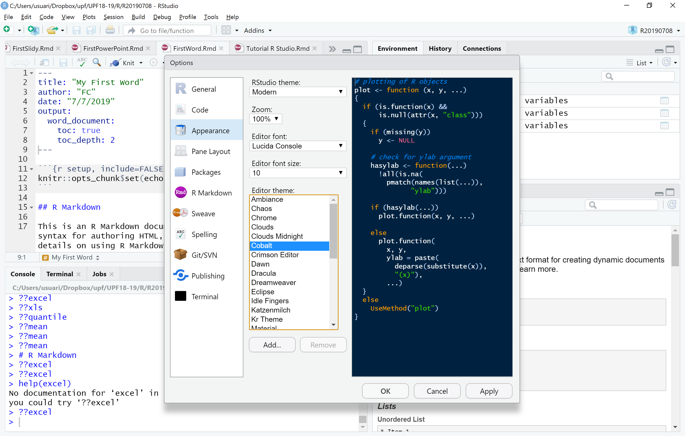
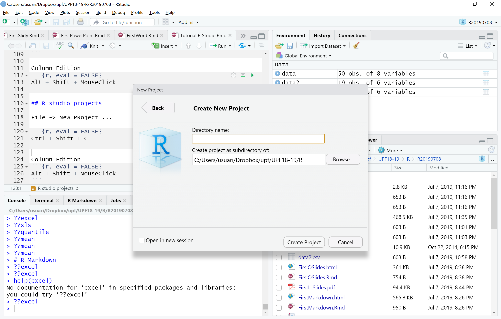

```{r setup, include=FALSE}
knitr::opts_chunk$set(echo = TRUE)
```

# Presentation


# Project guidelines

* [Guidelines](http://84.89.132.1/~satorra/dades/R2016GuidelinesForProject.pdf)
* Examples of projects [projects R2016](http://84.89.132.1/~satorra//R2014/R2016projects.html)

## Lit of topics

I attach some interesting data sources to help you in data selection:

* Data sources of economical data in Excel: http://www.economicswebinstitute.org/ecdata.htm 
* PISA Data: http://www.oecd.org/pisa/data/
* European statistical survey: http://www.europeansocialsurvey.org/
* Microdatos de INE (Insituto Nacional Estadística): http://www.ine.es/prodyser/microdatos.htm
* EU Open data portal: https://data.europa.eu/euodp/en/data
* Open Data USA: https://www.data.gov/

Be careful selecting a data set with enough cases and type of variables (continuous, categorical, ordinal...), and fix your dependent/s variable/s and independents.

# R Studio

## How to install R Studio
In order to run R and R-studio on your system, you need to follow the following three steps in the same order.

1. [Install R](https://cran.r-project.org/mirrors.html)
2. [Install R-Studio](https://www.rstudio.com/products/rstudio/download/)
3. [Install R-Packages (If needed)](https://cran.rediris.es/): More than 14k packages

## How to read a data file
1. Plain text file

```{r, eval = FALSE}
data <- read.csv("data.csv")
data2 <- read.csv2("data2.csv")
data3 <- read.table("data.txt", sep="\t", header=TRUE, dec=".")
```

2. Excel

```{r, eval = FALSE}
library(readxl)
data <- read_excel("data.xlsx")
```

3. SPSS

```{r, eval = FALSE}
library(foreign)
data<-read.spss("http://psych.colorado.edu/~carey/Courses/PSYC7291/DataSets/SPSS/crime.sav", to.data.frame =TRUE, use.value.labels = TRUE)
```

4. R

```{r, eval = FALSE}
load("rStateDataSold.RData")
```

## How to write a data file
1. Plain text file

```{r, eval = FALSE}
write.csv(data, file="0data.csv", row.names=FALSE)
write.csv2(data2,"0data2.csv", row.names=FALSE)
write.table(data3, "0data.txt", sep="\t", row.names=FALSE, dec=".")
```

2. R

```{r, eval = FALSE}
save(rStateDataSold, file="0rStateDataSold.RData")
```

## How to change code appearance

To change appearance, go to Tools -> Global options... -> Appearance -> Editor Theme -> Cobalt



## How to ask for help
To ask for help you have 2 options: 

1. With one ?
```{r, eval = FALSE}
?read.table
```
2. With double ?
```{r, eval = FALSE}
??excel
```

The shortkeys:
```{r, eval = FALSE}
Alt + Shift + K
```

## R studio GUI main sections

* Script
* Console
* Files
* Plots
* Packages
* Help
* Environment
* History

## R studio coding

Comment/Uncomment lines
```{r, eval = FALSE}
Ctrl + Shift + C
```

Column Edition
```{r, eval = FALSE}
Alt + Shift + MouseClick
```

## R studio projects

File -> New Project ... -> New Directory -> New project



You can manage the projects through top right menu. Each project need a new directory. The projects save, open and close the project script files.

# R Markdown

This is an R Markdown document. Markdown is a simple formatting syntax for authoring HTML, PDF, and MS Word documents. For more details on using R Markdown see <http://rmarkdown.rstudio.com>.

When you click the **Knit** button a document will be generated that includes both content as well as the output of any embedded R code chunks within the document. You can embed an R code chunk like this:

```{r cars}
summary(cars)

```

## Including Plots

You can also embed plots, for example:

```{r pressure, echo=TRUE}
plot(pressure)
```

Note that the `echo = FALSE` parameter was added to the code chunk to prevent printing of the R code that generated the plot.

Another one changing the size:

```{r scatterplot, fig.width=8, fig.height=6}
plot(pressure)
```

## R markdown help

You can have a look at the most common options in : Help -> Markdown Quick Reference

Also two CheatSheets:

* R markdown Cheat Sheet
* R markdown reference guide

Complete guide: https://bookdown.org/yihui/rmarkdown/

## Kind of output documents

* R Notebook
* R Documents
  + html
  + Word
* R Presentations
  + iolides
  + slidy
  + powerpoint

## Table of contents 

Look for the options in this [guide](https://bookdown.org/yihui/rmarkdown/html-document.html#table-of-contents)

## Latex formulas

This summation expression $\sum_{i=1}^n X_i$ appears inline.

This summation expression is in display form.

$$\sum_{i=1}^n X_i$$

## Tables

The easiest way to include tables is by using knitr::kable(), which can create tables for HTML, PDF and Word outputs. Table captions can be included by passing caption to the function, e.g.,

```{r tables-mtcars}
knitr::kable(iris[1:5, ], caption = 'A caption')
```

# Next steps:

* Tuesday 9th: 
  + Make groups of 2-3 people and select some topic for the project
  + submit Exercise 1 in html  
* Wednesday 10th: 
  + Bring your data for the project to class
  + submit exercise 2 in word format 
* Thursday 11th: submit a Markdown presentation of your data for the project:
  + Short description
  + Data source
  + sample size
  + Main variables (dependent, independent, control)
  + Univariate descriptive
